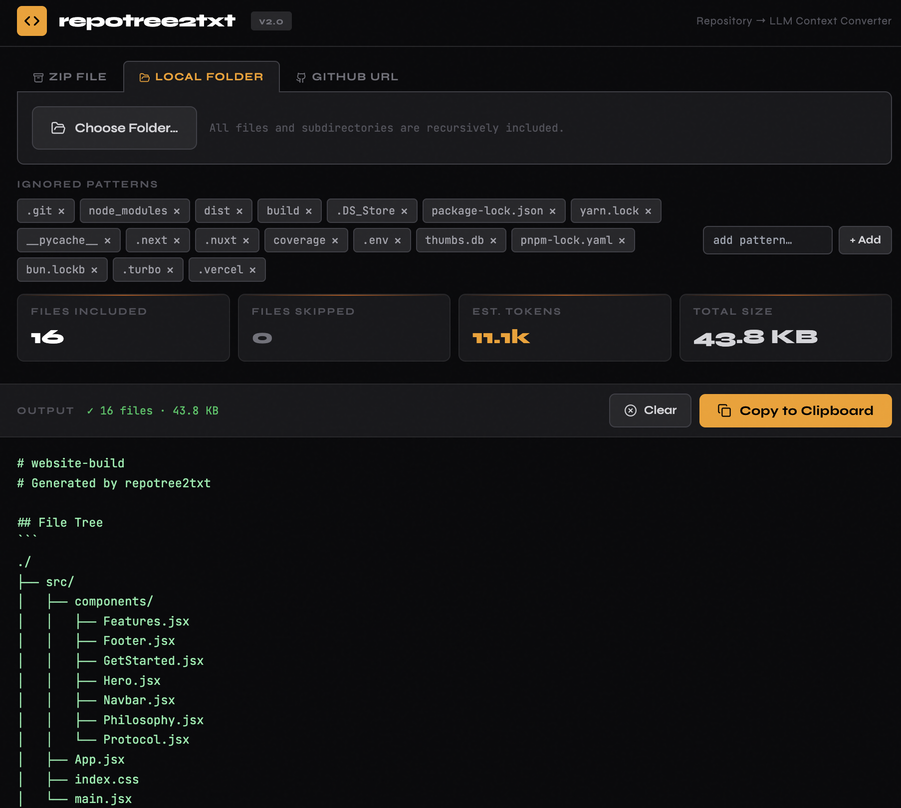

# repotree2txt

> Turns a GitHub repo, .zip or local folder into a single `.txt` file with a visual file tree, ready to paste into any LLM.

**[→ azeznassar.github.io/repotree2txt](https://azeznassar.github.io/repotree2txt)**




## What it does

You've got a codebase. You want to ask Claude, ChatGPT or Gemini something about it. But copy-pasting the files one by one is painful. **repotree2txt** solves that.

Drop in a repo (three ways), and it spits out one clean text file: an ASCII directory tree at the top, then every text file concatenated in order with clear headers. Copy it, paste it into your LLM of choice, and start asking questions about the whole codebase at once.

---

## Three ways to load a repo

**GitHub URL** — paste any of these and hit Fetch:
```
https://github.com/owner/repo
https://github.com/owner/repo/tree/some-branch
owner/repo
owner/repo@branch
```

**ZIP file** — drag and drop or click to browse. Works with GitHub's built-in "Download ZIP" export.

**Local folder** — click "Choose Folder" and pick any directory on your machine. All subdirectories are included automatically.

---

## Output format

````
# owner/repo
# Generated by repotree2txt

## File Tree
```
./
├── src/
│   ├── index.ts
│   └── utils/
│       └── parse.ts
├── package.json
└── README.md
```

────────────────────────────────────────────────────────────────

## File: src/index.ts
```ts
// file contents here...
```

## File: src/utils/parse.ts
```ts
// ...
```
````

---

## Smart filtering

repotree2txt skips things that would just waste tokens:

- **Binary detection** — checks the first 1,000 bytes of every file for null bytes. Images, fonts, compiled binaries, and other non-text files are silently skipped regardless of extension.
- **Default ignores** — `node_modules`, `.git`, `dist`, `build`, lock files, `__pycache__`, `.next`, `.env`, and more are excluded by default.
- **Custom ignores** — add or remove any pattern from the ignore list right in the UI before processing.

---

## GitHub rate limits

The GitHub API allows **60 requests/hour** without authentication, which is enough for small repos. For anything bigger, generate a [Personal Access Token](https://github.com/settings/tokens) (no special scopes needed for public repos) and paste it into the token field. That raises the limit to **5,000 requests/hour**.

The live rate badge in the UI shows how many calls you have remaining at all times.

---

## Stats

After processing, the app shows:

| Stat | What it means |
|---|---|
| Files Included | Text files that made it into the output |
| Files Skipped | Binaries, ignored paths, and unreadable files |
| Est. Tokens | `character count ÷ 4` — rough estimate for LLM context planning |
| Total Size | Size of the final output in bytes/KB/MB |

A warning appears if the output exceeds 10 MB, though processing still completes.

---

## Built with

- [JSZip](https://stuk.github.io/jszip/) — ZIP extraction in the browser
- [Lucide](https://lucide.dev/) — icons
- [Tailwind CSS](https://tailwindcss.com/) — utility styles
- [GitHub REST API](https://docs.github.com/en/rest) — repo tree and file fetching
- [JetBrains Mono](https://www.jetbrains.com/lp/mono/) + [Syne](https://fonts.google.com/specimen/Syne) — typography

---

## License

MIT
